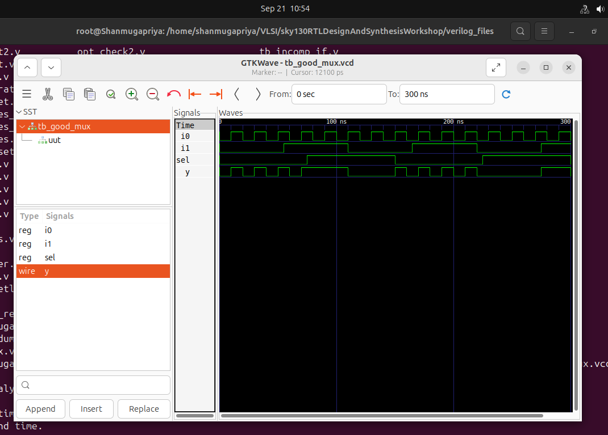
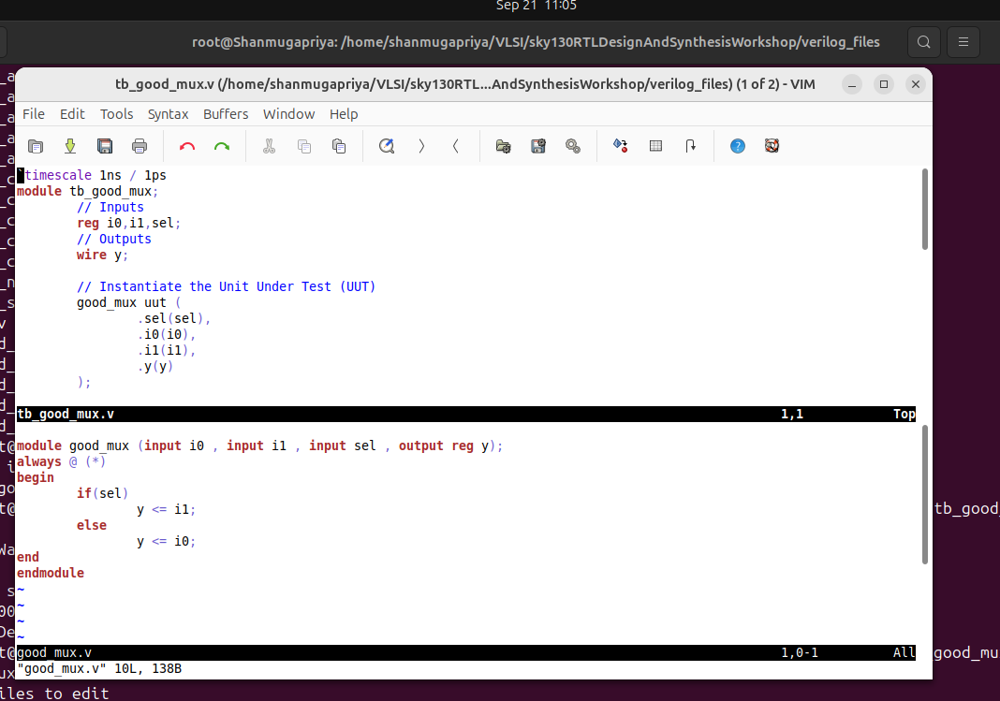
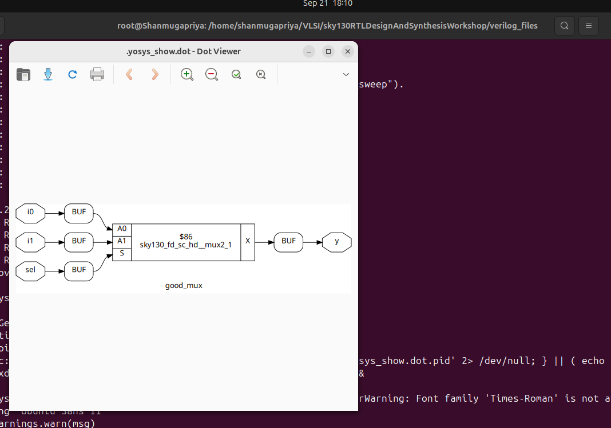
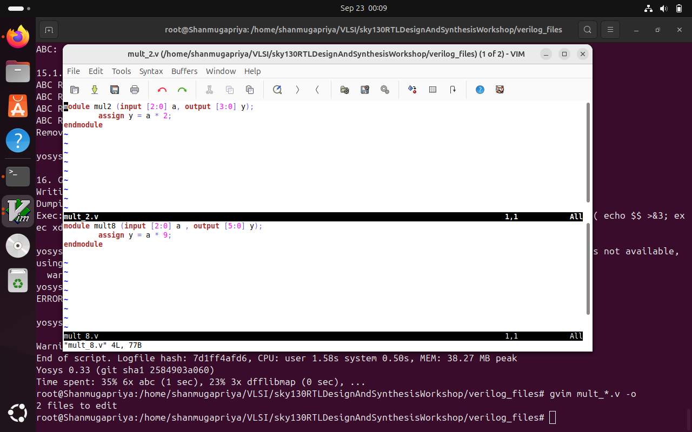

# RISC V SOC Tapeout Program VSD

<details>
  <summary>Week 0 </summary>

# Week 0 - Tools Installation

### **System Requirements**
- 6 GB RAM
- 50 GB HDD
- Ubuntu 20.04 or higher
- 4 vCPU

### <ins>**Yosys**</ins>
```bash
$ sudo apt-get update
$ git clone https://github.com/YosysHQ/yosys.git
$ cd yosys
$ sudo apt install make (If make is not installed please install it)
$ sudo apt-get install build-essential clang bison flex \
libreadline-dev gawk tcl-dev libffi-dev git \
graphviz xdot pkg-config python3 libboost-system-dev \
libboost-python-dev libboost-filesystem-dev zlib1g-dev
$ make config-gcc
$ make
$ sudo make install
```


### <ins>**Icarus Verilog**</ins>
```bash
$ sudo apt-get update
$ sudo apt-get install iverilog
```


### <ins>**Gtkwave**</ins>
```bash
$ sudo apt-get update
$ sudo apt install gtkwave
```


</details>


<details>
  <summary>Week 1 </summary>

  <details>
    <summary>Day 1</summary>

# Week 1 - Introduction to Verilog RTL design and Synthesis

# Day 1 - Introduction to Verilog RTL Design and Synthesis
## Introduction to open-source simulator Iverilog

Folder structure of the git clone:
- `lib` - will contain sky130 standard cell library
- `my_lib/verilog_models` - will contain standard cell verilog model
- `verilog_files` -contains the lab experiments source files


Example of a design good_mux.v 

```
module good_mux (input i0 , input i1 , input sel , output reg y);
always @ (*)
begin
	if(sel)
		y <= i1;
	else 
		y <= i0;
end
endmodule
```
Example of a testbench tb_good_mux.v 

```
`timescale 1ns / 1ps
module tb_good_mux;
	// Inputs
	reg i0,i1,sel;
	// Outputs
	wire y;

        // Instantiate the Unit Under Test (UUT)
	good_mux uut (
		.sel(sel),
		.i0(i0),
		.i1(i1),
		.y(y)
	);

	initial begin
	$dumpfile("tb_good_mux.vcd");
	$dumpvars(0,tb_good_mux);
	// Initialize Inputs
	sel = 0;
	i0 = 0;
	i1 = 0;
	#300 $finish;
	end

always #75 sel = ~sel;
always #10 i0 = ~i0;
always #55 i1 = ~i1;
endmodule
```
Command to run the design and testbench
```
iverilog good_mux.v tb_good_mux.v
```
The output of the iverilog is a .vcd file and a.out file is created. By executing a.out iverilog dump the vcd file.

## Introduction to GTKWave
gtkwave will be used to generate the waveforms and display in visual format.

Command to view the vcd file in gtkwave 

```
gtkwave tb_good_mux.vcd
```
The waveform in gtwave is shown below



## Introduction to Yosys
It is the synthesizer used to convert RTL to netlist.
Netlist should be the same as the Design but represented in the form of standard cells.
The same testbench can be used to verify RTL and Synthesized Netlist.


## Introduction to Logic Synthesis


## Lab using Yosys and Sky130 PDKs





</details>

<details>
    <summary>Day 2</summary>

# Day 2 - Timing libs, Hierarchical vs Flat Synthesis and Efficient Flop Coding Styles

## Introduction to timing .libs
Libraries are characterized based on PVT (process, voltage, temperature) \
Process -> Variations due to fabrication \
Voltage -> Variations due to voltage \
Temperature -> Variations due to temperature 

As seen in the screenshot below \
tt stands for typical in the .lib name \
025C stands for temperature of 25 C in the .lib name \
1v80 stands for voltage of 1.8V in the .lib name


-cell defines the beginning of the cell. Other information of cells mentioned are:
- Leakage power based on the combination of inputs
- Area
- Power ports
- Input capacitance
- Power associated with the pin
- Transition
- Delay

## Hierarchical vs Flat Synthesis

### Hierarchical Synthesis
Report after synthesizing multiple_modules.v. As shown below the sub_modules statistics are printed. For example, sub-module1 has 1 AND gate and sub-module2 has 1 OR gate. This is an example of Hierarchical Synthesis.


Hierarchy is preserved. sub_module1 and sub_module2 are instantiated separately in the synthesized Verilog netlist. Rather than seeing AND or OR gate, we see sub_modules when we run the command 'show' as shown in the screenshot.


If we look into the sub_module2 in synthesized netlist 'multiple_modules_hier.v', we see that rather than OR gate, the inputs a & b, pass through the inverter and then NAND gate. It is because in CMOS, stacking PMOS, which happens in 'OR' gate is bad as PMOS has lower mobility and always have to be wider to get some meaningful output. The next step is to check .lib file for the answer.

### Flat Synthesis
The design can be flattened by using the command `flatten`.

Screenshot shows the command, synthesized netlist and the logical diagram.


### Sub-module Level Synthesis
RTL (Register Transfer Level) designs are often modular, with various functional blocks or sub-modules. Sub-module level synthesis allows each of these sub-modules to be synthesized independently.

Why is the sub-module level synthesis necessary?
- Optimization and Area Reduction: By synthesizing sub-modules separately, the synthesis tool can optimize each one individually. It performs logic optimization, technology mapping, and area minimization for each sub-module. This leads to more efficient use of resources and reduced overall chip area.
- Resuability: Each submodule can be designed, verified, and optimized independently. They can be reused in a large design multiple times saving time and enhancing efficiency. 
- Parallel Processing: Different sub-modules can be synthesized concurrently, improving efficiency. For large designs, parallel synthesis significantly reduces turnaround time.

The commands to run sub-module synthesis
```
read_liberty -lib ../lib/sky130_fd_sc_hd__tt_025C_1v80.lib
read_verilog multiple_modules.v
synth -top sub_module1
abc -liberty ../lib/sky130_fd_sc_hd__tt_025C_1v80.lib
show
```

The screenshot shows that when sub_module1 is synthesized, only AND gate is generated. 


## Various Flop Coding Styles and Optimization

### Why do we need flops and how do they prevent glitches in the circuit?

Glitches can occur in digital circuits due to various reasons such as signal delays, noise, or timing issues. Flops prevent glitches during the operation in the following ways:
- Synchronization: Flops are edge-triggered devices, meaning they respond only to transitions of the input signal (e.g., rising edge, falling edge). This synchronization ensures that the output changes only at specific points, reducing the likelihood of glitches caused by transient signal variations.
- Timing Control: Flops are typically controlled by a clock signal, ensuring that all circuit operations occur synchronously. This eliminates timing issues that could lead to glitches due to data arriving at different times.


### Different types of flops
To initialize flops, we need to `set` and `reset` which can be synchronous or asynchronous.


The screenshot below shows DFF with asynchronous reset HDL simulation in Iverilog and  waveform display in GTKwave. Irrespective of the clock and d, as soon as async_reset=1, q=0.


### Synthesizing flops
The command to synthesize ***DFF with asynchronous reset*** as an example
```
read_liberty -lib ../lib/sky130_fd_sc_hd__tt_025C_1v80.lib
read_verilog dff_asyncres.v
synth -top dff_asyncres
dfflibmap -liberty ../lib/sky130_fd_sc_hd__tt_025C_1v80.lib
abc -liberty ../lib/sky130_fd_sc_hd__tt_025C_1v80.lib
show
```


On synthesizing ***DFF with synchronous reset*** we get NOR gate with inverted `d` as shown in the screenshot below. However,on evaluating the boolean expression, we reached the same logic realization. 


### Synthesizing mult2 (multiply by 2)

 
To implement `y[3:0] = 2*a[2:0]`, we append a `1'b0 `to the `a[2:0]` i.e, `y[3:0] = {a[2:0],0}`. This is also equal to left shift the input bits by 1.
This can be realized by just wiring.
So we expect no hardware which is also seen in the screenshot below, analysis after synthesis and show. The command 'abc' is not required for mapping when there are no cells.




### Synthesizing mult9 (multiply by 9 or 8+1)

`y=9*a` can be considered `8*a+1*a`
To implement `y[5:0] = 9*a[2:0]`, we append `000` to `a[2:0]` and then add `a` i.e, `y[5:0] = {a[2:0],000} + a[2:0]`.
This can be realized just by wiring.
So we expect no hardware which is also seen in the screenshot below, analysis after synthesis and show. The command 'abc' is not required for mapping when there are no cells.


</details>

<details>
	<summary>Day 3 - Combinational and Sequential Optimizations </summary>


