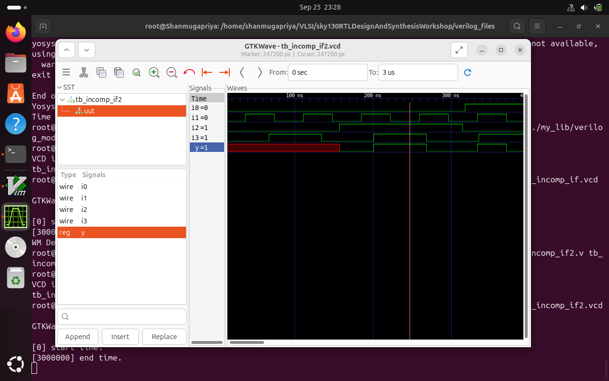
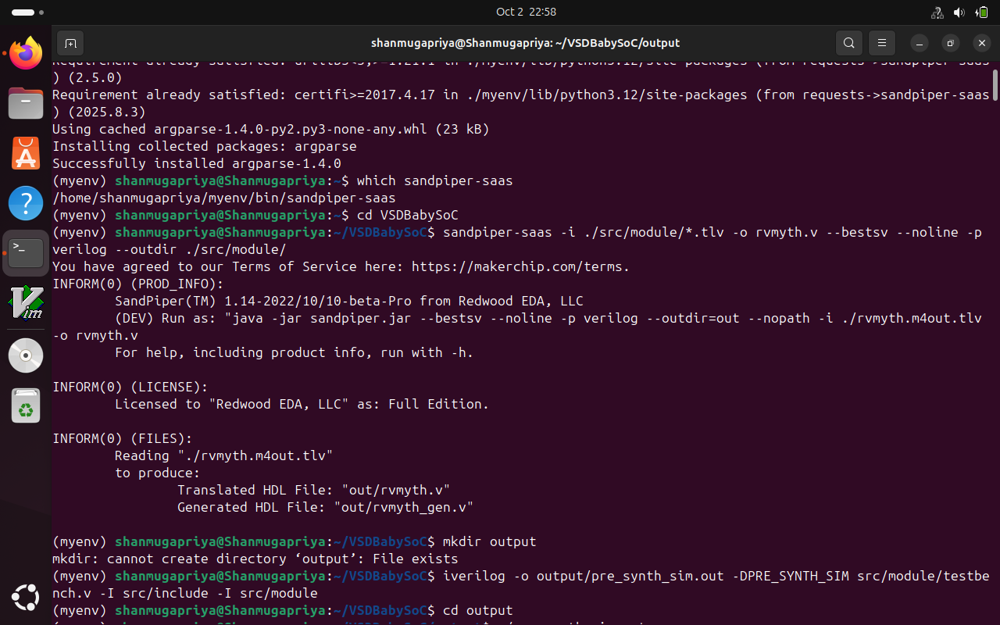
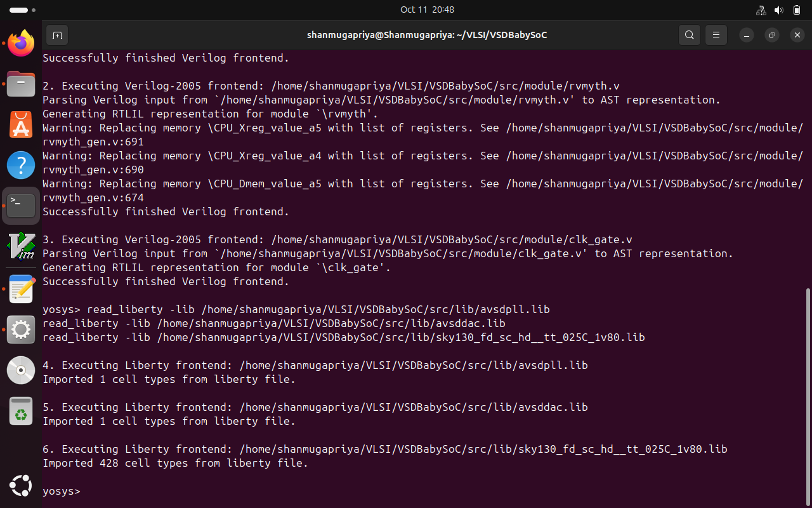

# RISC V SOC Tapeout Program VSD

<details>
  <summary>Week 0 </summary>

# Week 0 - Tools Installation

### **System Requirements**
- 6 GB RAM
- 50 GB HDD
- Ubuntu 20.04 or higher
- 4 vCPU

### <ins>**Yosys**</ins>
```bash
$ sudo apt-get update
$ git clone https://github.com/YosysHQ/yosys.git
$ cd yosys
$ sudo apt install make (If make is not installed please install it)
$ sudo apt-get install build-essential clang bison flex \
libreadline-dev gawk tcl-dev libffi-dev git \
graphviz xdot pkg-config python3 libboost-system-dev \
libboost-python-dev libboost-filesystem-dev zlib1g-dev
$ make config-gcc
$ make
$ sudo make install
```


### <ins>**Icarus Verilog**</ins>
```bash
$ sudo apt-get update
$ sudo apt-get install iverilog
```


### <ins>**Gtkwave**</ins>
```bash
$ sudo apt-get update
$ sudo apt install gtkwave
```


</details>

<details>
  <summary>Week 1 </summary>


   <details>
       <summary>Day 1 </summary>

## **Day 1 - Introduction to Verilog RTL Design and Synthesis**

### <ins>**Introduction to open-source simulator Iverilog**</ins>

Folder structure of the git clone:
- `lib` - will contain sky130 standard cell library
- `my_lib/verilog_models` - will contain standard cell verilog model
- `verilog_files` -contains the lab experiments source files


Example of a design good_mux.v 

```
module good_mux (input i0 , input i1 , input sel , output reg y);
always @ (*)
begin
	if(sel)
		y <= i1;
	else 
		y <= i0;
end
endmodule
```
Example of a testbench tb_good_mux.v 

```
`timescale 1ns / 1ps
module tb_good_mux;
	// Inputs
	reg i0,i1,sel;
	// Outputs
	wire y;

        // Instantiate the Unit Under Test (UUT)
	good_mux uut (
		.sel(sel),
		.i0(i0),
		.i1(i1),
		.y(y)
	);

	initial begin
	$dumpfile("tb_good_mux.vcd");
	$dumpvars(0,tb_good_mux);
	// Initialize Inputs
	sel = 0;
	i0 = 0;
	i1 = 0;
	#300 $finish;
	end

always #75 sel = ~sel;
always #10 i0 = ~i0;
always #55 i1 = ~i1;
endmodule
```
Command to run the design and testbench
```
iverilog good_mux.v tb_good_mux.v
```
The output of the iverilog is a .vcd file and a.out file is created. By executing a.out iverilog dump the vcd file.

### <ins>**Introduction to GTKWave**</ins>

Gtkwave will be used to generate the waveforms and display in visual format.

Command to view the vcd file in gtkwave 
```
gtkwave tb_good_mux.vcd
```
The waveform in gtwave is shown below


### <ins>**Introduction to Yosys**</ins>

It is the synthesizer used to convert RTL to netlist.
Netlist should be the same as the Design but represented in the form of standard cells.
The same testbench can be used to verify RTL and Synthesized Netlist.


### <ins>**Introduction to Logic Synthesis**</ins>


### <ins>**Lab using Yosys and Sky130 PDKs**</ins>


</details>

<details>
  <summary>Day 2 </summary>

	
## **Day 2 - Timing libs, Hierarchical vs Flat Synthesis and Efficient Flop Coding Styles**

### <ins>** Introduction to timing .libs**</ins>

Libraries are characterized based on PVT (process, voltage, temperature) \
Process -> Variations due to fabrication \
Voltage -> Variations due to voltage \
Temperature -> Variations due to temperature 

As seen in the screenshot below \
tt stands for typical in the .lib name \
025C stands for temperature of 25 C in the .lib name \
1v80 stands for voltage of 1.8V in the .lib name


-cell defines the beginning of the cell. Other information of cells mentioned are:
- Leakage power based on the combination of inputs
- Area
- Power ports
- Input capacitance
- Power associated with the pin
- Transition
- Delay

### <ins>**Hierarchical vs Flat Synthesis**</ins>

### <ins>**Hierarchical Synthesis**</ins>

Report after synthesizing multiple_modules.v. As shown below the sub_modules statistics are printed. For example, sub-module1 has 1 AND gate and sub-module2 has 1 OR gate. This is an example of Hierarchical Synthesis.


Hierarchy is preserved. sub_module1 and sub_module2 are instantiated separately in the synthesized Verilog netlist. Rather than seeing AND or OR gate, we see sub_modules when we run the command 'show' as shown in the screenshot.


If we look into the sub_module2 in synthesized netlist 'multiple_modules_hier.v', we see that rather than OR gate, the inputs a & b, pass through the inverter and then NAND gate. It is because in CMOS, stacking PMOS, which happens in 'OR' gate is bad as PMOS has lower mobility and always have to be wider to get some meaningful output. The next step is to check .lib file for the answer.

### <ins>**Flat Synthesis**</ins>

The design can be flattened by using the command `flatten`.

Screenshot shows the command, synthesized netlist and the logical diagram.


### <ins>**Sub-module Level Synthesis**</ins>

RTL (Register Transfer Level) designs are often modular, with various functional blocks or sub-modules. Sub-module level synthesis allows each of these sub-modules to be synthesized independently.

Why is the sub-module level synthesis necessary?

- Optimization and Area Reduction: By synthesizing sub-modules separately, the synthesis tool can optimize each one individually. It performs logic optimization, technology mapping, and area minimization for each sub-module. This leads to more efficient use of resources and reduced overall chip area.
- Resuability: Each submodule can be designed, verified, and optimized independently. They can be reused in a large design multiple times saving time and enhancing efficiency. 
- Parallel Processing: Different sub-modules can be synthesized concurrently, improving efficiency. For large designs, parallel synthesis significantly reduces turnaround time.

The commands to run sub-module synthesis
```
read_liberty -lib ../lib/sky130_fd_sc_hd__tt_025C_1v80.lib
read_verilog multiple_modules.v
synth -top sub_module1
abc -liberty ../lib/sky130_fd_sc_hd__tt_025C_1v80.lib
show
```

The screenshot shows that when sub_module1 is synthesized, only AND gate is generated. 


### <ins>**Various Flop Coding Styles and Optimization**</ins>

### <ins>**Why do we need flops and how do they prevent glitches in the circuit?**</ins>

Glitches can occur in digital circuits due to various reasons such as signal delays, noise, or timing issues. Flops prevent glitches during the operation in the following ways:

- Synchronization: Flops are edge-triggered devices, meaning they respond only to transitions of the input signal (e.g., rising edge, falling edge). This synchronization ensures that the output changes only at specific points, reducing the likelihood of glitches caused by transient signal variations.
- Timing Control: Flops are typically controlled by a clock signal, ensuring that all circuit operations occur synchronously. This eliminates timing issues that could lead to glitches due to data arriving at different times.


### <ins>**Different types of flops**</ins>

To initialize flops, we need to `set` and `reset` which can be synchronous or asynchronous.


The screenshot below shows DFF with asynchronous reset HDL simulation in Iverilog and  waveform display in GTKwave. Irrespective of the clock and d, as soon as async_reset=1, q=0.


### <ins>**Synthesizing flops**</ins>

The command to synthesize ***DFF with asynchronous reset*** as an example
```
read_liberty -lib ../lib/sky130_fd_sc_hd__tt_025C_1v80.lib
read_verilog dff_asyncres.v
synth -top dff_asyncres
dfflibmap -liberty ../lib/sky130_fd_sc_hd__tt_025C_1v80.lib
abc -liberty ../lib/sky130_fd_sc_hd__tt_025C_1v80.lib
show
```


On synthesizing ***DFF with synchronous reset*** we get NOR gate with inverted `d` as shown in the screenshot below. However,on evaluating the boolean expression, we reached the same logic realization. 


### <ins>**Synthesizing mult2 (multiply by 2)**</ins>

 
To implement `y[3:0] = 2*a[2:0]`, we append a `1'b0 `to the `a[2:0]` i.e, `y[3:0] = {a[2:0],0}`. This is also equal to left shift the input bits by 1.
This can be realized by just wiring.
So we expect no hardware which is also seen in the screenshot below, analysis after synthesis and show. The command 'abc' is not required for mapping when there are no cells.


### <ins>**Synthesizing mult9 (multiply by 9 or 8+1)**</ins>

`y=9*a` can be considered `8*a+1*a`
To implement `y[5:0] = 9*a[2:0]`, we append `000` to `a[2:0]` and then add `a` i.e, `y[5:0] = {a[2:0],000} + a[2:0]`.
This can be realized just by wiring.
So we expect no hardware which is also seen in the screenshot below, analysis after synthesis and show. The command 'abc' is not required for mapping when there are no cells.


</details>

<details>
	<summary>Day 3</summary>
	
## **Day 3 - Combinational and Sequential Optimizations**

### <ins>**Introduction to Optimizations**</ins>

### <ins>**Combinational Logic Optimization**</ins>

It means squeezing the logic to get the most optimized design in terms of area and power. the most commonly used techniques are:
1) Constant propagation using direct optimization
2) Boolean logic optimization using K-map and Quine McKlusky

An example of constant propagation optimization is highlighted below.


An example of boolean optimization is highlighted below.


### <ins>**Sequential Logic Optimization**</ins>

The technqiues used are:

1) Basic
   - Sequential constant propagation
2) Advanced (not covered as part of lab)
   - Static optimization
   - Retiming
   - Sequential logic cloning (floorplan aware synthesis)

An example of sequential constant propagation is highlighted below of DFF with asynchronous reset where D input is grounded. To note, the same technique cannot be applied to DFF with the asynchronous set because while `Q=1` when `Set=1`, but `Q=0` at `Set=0` at the next CLK pulse. Q is dependent not only on Set but also on the clock edge.


Retiming is a technique to improve the performance of the circuit.


### <ins>**Combinational Logic Optimizations**</ins>

Commands for optimization

```
opt_clean -purge
```
### <ins>**Optimization of opt_check.v**</ins>

Syntax for opt_check.v
```
module opt_check (input a , input b , output y);
        assign y = a?b:0;
endmodule
```
For opt_check.v the assignment `y = a?b:0` reduces to `y = ab`. The screenshot shown below explains this


The logic implementation after synthesis for opt_check.v is shown below, showing only AND gate.


### <ins>**Optimization of opt_check2.v**</ins>

Syntax for opt_check2.v
```
module opt_check2 (input a , input b , output y);
        assign y = a?1:b;
endmodule
```
For opt_check2.v the assignment `y = a?1:b` reduces to `y = a + b`. 

The logic implementation after synthesis for opt_check2.v is shown below, showing only OR gate.


### <ins>**Optimization of opt_check3.v**</ins>

Syntax for opt_check3.v
```
module opt_check3 (input a , input b, input c , output y);
	assign y = a?(c?b:0):0;
endmodule
```
For opt_check.v the assignment `y = a?(c?b:0):0` reduces to `y = abc`. The screenshot shown below explains this.


The logic implementation after synthesis for opt_check3.v is shown below, showing 3 input AND gate.


### <ins>**Optimization of multiple_module_opt.v**</ins>

Syntax of multiple_module_opt.v
```
module sub_module1(input a , input b , output y);
 assign y = a & b;
endmodule

module sub_module2(input a , input b , output y);
 assign y = a^b;
endmodule

module multiple_module_opt(input a , input b , input c , input d , output y);
wire n1,n2,n3;

sub_module1 U1 (.a(a) , .b(1'b1) , .y(n1));
sub_module2 U2 (.a(n1), .b(1'b0) , .y(n2));
sub_module2 U3 (.a(b), .b(d) , .y(n3));

assign y = c | (b & n1); 
endmodule
```
The logic implementation after synthesis for multiple_module_opt.v is shown below.


### <ins>**Sequential Logic Optimizations**</ins>

Both the dff_const1.v and dff_const2 are explained below.


### <ins>**Optimizing dff_const1.v**</ins>

Syntax for dff_const1.v
```
module dff_const1(input clk, input reset, output reg q);
always @(posedge clk, posedge reset)
begin
	if(reset)
		q <= 1'b0;
	else
		q <= 1'b1;
end

endmodule
```
For dff_const1.v, `q=0` as long as `reset=1`. However, when `reset=0` `q` doesn't immediately becomes `1` rather at the next rising edge of the `clk` as shown below. ***So the optimization cannot be applied***.


The commands to run the synthesis
```
read_liberty -lib ../lib/sky130_fd_sc_hd__tt_025C_1v80.lib
read_verilog dff_const1.v
synth -top dff_const1
dfflibmap -liberty ../lib/sky130_fd_sc_hd__tt_025C_1v80.lib
abc -liberty ../lib/sky130_fd_sc_hd__tt_025C_1v80.lib
show
```

The logic implementation after synthesis for dff_const1.v is shown below.


***complete dff_const2,4,5***

### <ins>**Optimizing dff_const3.v**</ins>

Syntax for dff_const3.v
```
module dff_const3(input clk, input reset, output reg q);
reg q1;

always @(posedge clk, posedge reset)
begin
	if(reset)
	begin
		q <= 1'b1;
		q1 <= 1'b0;
	end
	else
	begin
		q1 <= 1'b1;
		q <= q1;
	end
end

endmodule
```
For dff_const3.v, there are two flops.  `q1=0` as long as `reset=1`. However, when `reset=0` `q1` doesn't immediately becomes `1` rather at the next rising edge of the `clk` with some propagation delay as shown below. `q=1` as long as `reset=1`, acting as `set` rather than `reset`. However, when `reset=0` `q` samples `q1` as `0` as there are some propagation delay for `q1`as shown below. At the next `clk` edge `q` samples `q1` as `1`.
***So the optimization cannot be applied***.


The command to run HDL simulation
```
iverilog dff_const3.v tb_dff_const3.v
./a.out
gtkwave tb_dff_const3.vcd
```
The HDL simulation is shown below.


The commands to run the synthesis
```
read_liberty -lib ../lib/sky130_fd_sc_hd__tt_025C_1v80.lib
read_verilog dff_const3.v
synth -top dff_const3
dfflibmap -liberty ../lib/sky130_fd_sc_hd__tt_025C_1v80.lib
abc -liberty ../lib/sky130_fd_sc_hd__tt_025C_1v80.lib
show
```

The logic implementation after synthesis for dff_const3.v is shown below.


### <ins>**Sequential Optimzations for Unused Outputs**</ins>

### <ins>**Optimization of Case1: 3-bit Up Counter with q[0] used (counter_opt.v)**</ins>

Example of a counter where bits at the position of [2] and [1] are unused.

```
module counter_opt (input clk , input reset , output q);
reg [2:0] count;
assign q = count[0];

always @(posedge clk ,posedge reset)
begin
	if(reset)
		count <= 3'b000;
	else
		count <= count + 1;
end

endmodule
```
The screenshot explains the logic of the counter. Only q[0] is used. ***So the optimization can be applied***.


</details>

<details>

 <summary>Day 4 </summary>
 
## **Day 4 - GLS, Blocking vs Non-blocking and Synthesis-Simulation Mismatch**

### <ins>**GLS, Synthesis-Simulation Mismatch, and Blocking/Non-blocking Statements**</ins>

### <ins>**Why is Gate Level Simulation (GLS) necessary?**</ins>

- Verify the correctness of the design after synthesis
- Ensure the timing of the design is met which is done with delay annotation (timing aware)


  
### <ins>**Synthesis Simulation Mismatches**</ins>

It happens because of the following reasons
- Missing sensitivity list
- Blocking vs non-blocking assignments
- Non-standard verilog coding

### <ins>**(1) Missing sensitivity list**</ins>

As shown in the screenshot below, `always` block is evaluated only when `sel` is changing. So output `y` is not evaluated when `sel` is not changing although `i0` and `i1` are changing. Rather it acts like a latch. The code on the right side represents the correct design coding for `mux`. In this case `always` is evaluated for any signal changes. 


### <ins>**(2) Blocking vs Non-blocking Assignments**</ins>

 ### <ins>**Blocking Statements**</ins>
 
 - Represented by `=`
 - Executes the statements in the order it is written inside always block
 - So the first statement is evaluated before the second statement

### <ins>**Non-Blocking Statements**</ins>

- Represented by `<=`
- Executes all the RHS when always block is entered and assigns to LHS
- Parallel execution

   The left side of the screenshot below gives us the correct execution. While the right side can lead to serious issues as `d` is assigned to `q` directly. ***So choosing non-blocking statements is best practice*** (highlighted in the screenshot below).


 ### <ins>**Blocking Statements Leading to Synthesis Simulation Mismatch**</ins>

In the code shown below, `y` gets the old `q0` value. This will mimic delay or flop. But when you synthesize, there will be no flop. If the order is changed (right side code), latest value of `q0` is assigned to `y`. 

When synthesized, both will lead to the same circuit. However, simulation will result in different behavior. For the left side of the code, `y` gets the old `q0` value and for the right side of the code, `y` gets the latest `q0` value leading to a synthesis simulation mismatch. 

This issue is resolved by using ***non-blocking statements***.


### <ins>**Labs on GLS and Synthesis-Simulation Mismatch**</ins>

### <ins>**Ternary operator MUX (ternary_operator_mux.v)**</ins>

The Verilog code of ternary_operator_mux.v
```
module ternary_operator_mux (input i0 , input i1 , input sel , output y);
	assign y = sel?i1:i0;
	endmodule
```
The command to run HDL simulation
```
iverilog ternary_operator_mux.v tb_ternary_operator_mux.v
./a.out
gtkwave tb_ternary_operator_mux.vcd
```
HDL Simulation waveform of ternary_operator_mux.v is shown in the screenshot below


The commands to run the synthesis for ternary_operator_mux.v
```
read_liberty -lib ../lib/sky130_fd_sc_hd__tt_025C_1v80.lib
read_verilog ternary_operator_mux.v
synth -top ternary_operator_mux
abc -liberty ../lib/sky130_fd_sc_hd__tt_025C_1v80.lib
show
write_verilog ternary_operator_mux_net.v
```


The commands to do GLS for ternary_operator_mux.v
```
iverilog ../my_lib/verilog_model/primitives.v ../my_lib/verilog_model/sky130_fd_sc_hd.v ternary_operator_mux_net.v tb_ternary_operator_mux.v
./a.out
gtkwave tb_ternary_operator_mux.vcd
```
The GLS output is shown below.


### <ins>**Bad MUX (bad_mux.v)**</ins>

The `always` block is executed only at `sel` signal. It works like a flop rather than mux.
The Verilog code of bad_mux.v
```
module bad_mux (input i0 , input i1 , input sel , output reg y);
always @ (sel)
begin
	if(sel)
		y <= i1;
	else 
		y <= i0;
end
endmodule
```

The command to run HDL simulation
```
iverilog bad_mux.v tb_bad_mux.v
./a.out
gtkwave tb_bad_mux.vcd
```
HDL Simulation waveform of bad_mux.v is shown in the screenshot below


The commands to run the synthesis for bad_mux.v.
```
read_liberty -lib ../lib/sky130_fd_sc_hd__tt_025C_1v80.lib
read_verilog bad_mux.v
synth -top bad_mux
abc -liberty ../lib/sky130_fd_sc_hd__tt_025C_1v80.lib
show
write_verilog bad_mux_net.v
```

The synthesis report shows it is still inferring the mux but not the flop.


The commands to do GLS for bad_mux.v
```
iverilog ../my_lib/verilog_model/primitives.v ../my_lib/verilog_model/sky130_fd_sc_hd.v bad_mux_net.v tb_bad_mux.v
./a.out
gtkwave tb_bad_mux.vcd
```
The GLS output is shown below. This shows correct functionality which is different from HDL simulation, leading to ***synthesis simulation mismatch***.


### <ins>**Labs on Synthesis-Simulation Mismatch for Blocking Statements**</ins>

### <ins>**Blocking Caveat (blocking_caveat.v)**</ins>

The logic to simulate is shown below.


The Verilog code of blocking_caveat.v
```
module blocking_caveat (input a , input b , input  c, output reg d); 
reg x;
always @ (*)
begin
	d = x & c;
	x = a | b;
end
endmodule
```

The command to run HDL simulation
```
iverilog blocking_caveat.v tb_blocking_caveat.v
./a.out
gtkwave tb_blocking_caveat.vcd
```
HDL Simulation waveform of blocking_caveat.v is shown in the screenshot below. `d` takes the old value of `x` causing incorrect functionality.


The commands to run the synthesis for bad_mux.v.
```
read_liberty -lib ../lib/sky130_fd_sc_hd__tt_025C_1v80.lib
read_verilog blocking_caveat.v
synth -top blocking_caveat
abc -liberty ../lib/sky130_fd_sc_hd__tt_025C_1v80.lib
show
write_verilog blocking_caveat_net.v
```

The synthesis report and logic synthesis is shown below.


The commands to do GLS for bad_mux.v
```
iverilog ../my_lib/verilog_model/primitives.v ../my_lib/verilog_model/sky130_fd_sc_hd.v blocking_caveat_net.v tb_blocking_caveat.v
./a.out
gtkwave tb_blocking_caveat.vcd
```
The GLS output is shown below. In this case, `d` takes the current value of `x` causing incorrect functionality.The waveform shows correct functionality which is different from HDL simulation, leading to ***synthesis simulation mismatch***.


</details>

<details>

 <summary>Day 5 </summary>

 ## **Day 5- Optimization in Synthesis**

### <ins>**If-Case Constructs**</ins>

### <ins>**Understanding If Statements in Hardware Context**</ins>

When we write an `if` statement in Verilog, we're not just creating a conditional check - we're describing hardware behavior. The synthesis tool interprets these constructs and creates actual digital circuits.

### <ins>**Priority Logic Architecture**</ins>

```
// This RTL description...
always @(*) begin
    if (condition1)
        output = input1;
    else if (condition2)
        output = input2;
    else if (condition3)
        output = input3;
    else
        output = default_value;
end
```

 Creates a **priority encoder** followed by a **multiplexer chain** in hardware. The first condition has the highest priority, and the evaluation proceeds sequentially until a match is found.

### <ins>**The Latch Inference Trap**</ins>

The most critical issue in synthesis occurs when we write incomplete conditional statements:

```
// Creates unwanted latch
always @(*) begin
    if (en)t
        data_out = data_in;
    // Missing else clause!
end
```

**Why does this happen?** When `enable` is false, the synthesis tool doesn't know what value `data_out` should take. To maintain the previous value, it infers a **D-latch** - creating sequential behavior in what should be combinational logic.

### <ins>**Proper Combinational Logic**</ins>

```
// Complete specification
always @(*) begin
    if (enable)
        data_out = data_in;
    else
        data_out = 1'b0;  // Explicit default
end
```

### <ins>**When Latches Are Acceptable**</ins>

In sequential circuits, incomplete if statements are often intentional:

```
//  Sequential counter logic
always @(posedge clk or posedge reset) begin
    if (reset)
        counter <= 0;
    else if (increment)
        counter <= counter + 1;
    // No else needed - register holds value
end
```
---

### <ins>**Case Statements: Parallel Selection Logic**</ins>

Case statements provide a different approach to multi-way selection, synthesizing into **multiplexers** rather than priority logic.

### <ins>**Basic Multiplexer Implementation**</ins>

```
always @(*) begin
    case (selector)
        2'b00: output = input0;
        2'b01: output = input1;
        2'b10: output = input2;
        2'b11: output = input3;
    endcase
end
```

This creates a clean 4:1 multiplexer in hardware - much more efficient than equivalent if-else chains for parallel selection.

### <ins>**Three Critical Pitfalls**</ins>

### <ins>**Caveat 1: Incomplete Case Coverage**</ins>

```
// Missing cases
case (select)
    2'b00: y = a;
    2'b01: y = b;
    // What happens for 2'b10 and 2'b11?
endcase
```
**Solution:** Always include a `default` case to handle uncovered conditions.

### <ins>**Caveat 2: Partial Assignment**</ins>

```
// Inconsistent assignments
case (mode)
    2'b00: begin
        x = data1;
        y = data2;  // Both assigned
    end
    2'b01: begin
        x = data3;  // y not assigned - latch inferred!
    end
endcase
```
**Solution:** Ensure all outputs are assigned in every case branch.

### <ins>**Caveat 3: Overlapping Cases**</ins>

```
// Ambiguous specification
case (sel)
    2'b00: y = a;
    2'b01: y = b;
    2'b10: y = c;
    2'b1?: y = d;  // Overlaps with 2'b10!
endcase
```

Unlike if-else statements (which have built-in priority), overlapping cases create undefined behavior.

### <ins>**Incomplete If Analysis**</ins>

We begin our practical investigation with two critical test cases that demonstrate latch inference in action.

### <ins>**Experiment: incomp_if.v**</ins>

```
module incomp_if (input i0, i1, i2, output reg y);
always @(*) begin
    if(i0)
        y <= i1;
    // Deliberately incomplete
end
endmodule
```

**Laboratory Procedure:**

```
# RTL Simulation
iverilog incomp_if.v tb_incomp_if.v
./a.out
gtkwave tb_incomp_if.vcd
```


**Observations from RTL Simulation:** The waveform shows expected behavior - when `i0` is high, `y` follows `i1`. When `i0` is low, `y` maintains its previous value.

**Synthesis Analysis:**

```
# Yosys Synthesis Flow
read_liberty -lib ../my_lib/lib/sky130_fd_sc_hd__tt_025C_1v80.lib
read_verilog incomp_if.v
synth -top incomp_if
abc -liberty ../my_lib/lib/sky130_fd_sc_hd__tt_025C_1v80.lib
show
```


**Critical Discovery:** The synthesis output reveals a D-latch connected to a multiplexer. This is hardware we didn't intend to create! The latch enables the "memory" behavior observed in simulation.

**GLS Wave**

```
iverilog ../my_lib/verilog_model/primitives.v ../my_lib/verilog_model/sky130_fd_sc_hd.v incomp_if_net.v tb_incomp_if.v
./a.out
gtkwave tb_incomp_if.vcd
```

### <ins>**Experiment: incomp_if2.v**

```
module incomp_if2 (input i0, i1, i2, i3, output reg y);
always @(*) begin
    if(i0)
        y <= i1;
    else if (i2)
        y <= i3;
    // Still incomplete - no final else
end
endmodule
```



**Synthesis Analysis:**

```
# Yosys Synthesis Flow
read_liberty -lib ../my_lib/lib/sky130_fd_sc_hd__tt_025C_1v80.lib
read_verilog incomp_if2.v
synth -top incomp_if2
abc -liberty ../my_lib/lib/sky130_fd_sc_hd__tt_025C_1v80.lib
show
```


### <ins>**Case Statement Exploration**</ins>

Our investigation continues with systematic analysis of case statement behaviors and their synthesis implications.

### <ins>**Experiment: incomp_case.v**</ins>

```
module incomp_case (input i0, i1, i2, input [1:0] sel, output reg y);
always @(*) begin
    case(sel)
        2'b00: y = i0;
        2'b01: y = i1;
        // Missing 2'b10 and 2'b11 cases
    endcase
end
endmodule
```

**Lab Procedure**

```
# RTL Simulation
iverilog incomp_case.v tb_incomp_case.v
./a.out
gtkwave tb_incomp_case.vcd
```


**Synthesis Analysis:**

```
# Yosys Synthesis Flow
read_liberty -lib ../my_lib/lib/sky130_fd_sc_hd__tt_025C_1v80.lib
read_verilog incomp_case.v
synth -top incomp_case
abc -liberty ../my_lib/lib/sky130_fd_sc_hd__tt_025C_1v80.lib
write_verilog -noattr incomp_case_net.v
show
```


**Synthesis Result:** Similar to incomplete if statements, the missing cases result in latch inference. The synthesized circuit includes memory elements for the uncovered selector values.


**GLS Wave**

```
iverilog ../my_lib/verilog_model/primitives.v ../my_lib/verilog_model/sky130_fd_sc_hd.v incomp_if_net.v tb_incomp_if.v
./a.out
gtkwave tb_incomp_if.vcd
```


### <ins>**Experiment: comp_case.v (Complete Case)**</ins>

```
module comp_case (input i0, i1, i2, input [1:0] sel, output reg y);
always @(*) begin
    case(sel)
        2'b00: y = i0;
        2'b01: y = i1;
        default: y = i2;  // Covers remaining cases
    endcase
end
endmodule
```
**Lab Procedure**

```
# RTL Simulation
iverilog comp_case.v tb_comp_case.v
./a.out
gtkwave tb_incomp_case.vcd
```


**Synthesis Analysis:**

```
# Yosys Synthesis Flow
read_liberty -lib ../my_lib/lib/sky130_fd_sc_hd__tt_025C_1v80.lib
read_verilog comp_case.v
synth -top comp_case
abc -liberty ../my_lib/lib/sky130_fd_sc_hd__tt_025C_1v80.lib
write_verilog -noattr comp_case_net.v
show
```


**Synthesis Result:** Clean multiplexer implementation with no latches. This demonstrates the importance of complete case coverage.

**GLS Wave**

```
iverilog ../my_lib/verilog_model/primitives.v ../my_lib/verilog_model/sky130_fd_sc_hd.v incomp_if_net.v tb_incomp_if.v
./a.out
gtkwave tb_incomp_if.vcd
```


### <ins>**Experiment: bad_case.v (Overlapping Cases)**</ins>

```
module bad_case (input i0, i1, i2, i3, input [1:0] sel, output reg y);
always @(*) begin
    case(sel)
        2'b00: y = i0;
        2'b01: y = i1;
        2'b10: y = i2;
        2'b1?: y = i3;  // Wildcard overlaps with 2'b10
    endcase
end
endmodule
```
**Lab Procedure**

```
# RTL Simulation
iverilog bad_case.v tb_bad_case.v
./a.out
gtkwave tb_bad_case.vcd
```


**Synthesis Analysis:**

```
# Yosys Synthesis Flow
read_liberty -lib ../my_lib/lib/sky130_fd_sc_hd__tt_025C_1v80.lib
read_verilog bad_case.v
synth -top bad_case
abc -liberty ../my_lib/lib/sky130_fd_sc_hd__tt_025C_1v80.lib
write_verilog -noattr comp_case_net.v
show
```


**Critical Insight:** The wildcard pattern `2'b1?` matches both `2'b10` and `2'b11`, creating ambiguity. Synthesis tools may resolve this differently than simulation, leading to **functional mismatches**.

**GLS Wave**

```
iverilog ../my_lib/verilog_model/primitives.v ../my_lib/verilog_model/sky130_fd_sc_hd.v incomp_if_net.v tb_incomp_if.v
./a.out
gtkwave tb_incomp_if.vcd
```


### <ins>**Experiment: partial_case_assign.v**</ins>

```
module partial_case_assign (input i0, i1, i2, input [1:0] sel, 
                           output reg y, x);
always @(*) begin
    case(sel)
        2'b00: begin
            y = i0;
            x = i2;  // Both outputs assigned
        end
        2'b01: y = i1;  // Only y assigned - x gets latch!
        default: begin
            x = i1;
            y = i2;
        end
    endcase
end
endmodule
```


**Synthesis Analysis:** The output reveals **mixed behavior** - `y` is purely combinational, while `x` has a latch for the `2'b01` case. This creates a circuit with both combinational and sequential elements from a single always block.

</details>
</details>


<details>
  <summary>Week 2 </summary>

# Week 2 - BabySoc Fundamentals and Functional Modelling

 <details>
  <summary> Theory </summary>

  # Problem Statement
This project delves into designing a compact, open-source **System on Chip (SoC)** based on **RVMYTH**, a RISC-V-based processor core. The SoC integrates a **Phase-Locked Loop (PLL)** for precise clock generation and control, alongside a **10-bit Digital-to-Analog Converter (DAC)** for interfacing with external analog systems. By converting digital signals into analog, this DAC allows BabySoC to communicate with devices that accept analog inputs, such as televisions and mobile phones, enabling output in the form of audio or video. Ultimately, this Sky130-technology-based SoC aims to provide a highly documented, educational platform for learning and experimentation in digital-analog interfacing.

<details>
<summary>1. Understanding System on a Chip (SoC)</summary>

   A **System on a Chip (SoC)** is like a mini-computer built on a single chip. Instead of needing separate parts for each function, an SoC combines everything into one small package. This makes it especially useful for devices where space, power, and efficiency are important, like smartphones, smartwatches, and tablets. Let's break down what an SoC includes and why it's essential:

### Key Parts of an SoC

1. **CPU (Central Processing Unit)**:
   - The brain of the SoC, handling all main instructions and decisions.
   - Manages tasks like calculations, data processing, and running applications.

2. **Memory**:
   - **RAM** (Random Access Memory) for temporarily storing data as you use the device.
   - **ROM** or **Flash Storage** for keeping information saved even when the device is off.

3. **I/O Ports (Input/Output)**:
   - Connects the SoC to other parts or devices, like a camera, USB, or even your headphones.
   - These ports let the SoC send and receive data externally.

4. **Graphics Processing Unit (GPU)**:
   - Responsible for creating visuals on your screen.
   - Used for gaming, watching videos, or any activity involving images or animations.

5. **Digital Signal Processor (DSP)**:
   - Specialized in processing audio and video signals.
   - Helps with tasks like noise reduction in phone calls or enhancing video quality.

6. **Power Management**:
   - Regulates power usage within the SoC, making sure the chip operates efficiently.
   - This is crucial for extending battery life in portable devices.

7. **Special Features**:
   - Additional features may include Wi-Fi, Bluetooth, and even security modules for safe data handling.
   - These features vary depending on the specific purpose of the SoC.

### Why SoCs Are Awesome

- **Space Saving**: By combining everything into one chip, SoCs help make devices smaller and more portable.
- **Energy Efficient**: Because all the parts are so close together, they use less power, which is especially important for battery-operated devices.
- **High Performance**: Since data doesn't have to travel far, SoCs can process information faster.
- **Cost Effective**: Building a single chip is often cheaper than using multiple parts, reducing the cost for manufacturers and, ultimately, for consumers.
- **Reliable**: Fewer parts mean fewer points of failure, making devices with SoCs generally more dependable.

### Where You’ll Find SoCs

- **Smartphones & Tablets**: Almost all modern mobile devices use SoCs because of their compact size and efficiency.
- **Wearables**: Devices like smartwatches rely on SoCs for their small size and low power use.
- **IoT Gadgets**: Internet of Things devices, like smart home sensors, often use SoCs to handle tasks like monitoring and connecting to Wi-Fi.
- **Cars, TVs, and More**: Embedded systems in cars, TVs, and appliances may also use SoCs to manage their internal functions.

### Some Popular SoCs You Might Know

- **Apple A-Series**: Powers iPhones and iPads.
- **Qualcomm Snapdragon**: Found in many Android phones.
- **Samsung Exynos**: Built for Samsung devices.
- **NVIDIA Tegra**: Powers devices like the Nintendo Switch.

### Challenges with SoCs

- **Complex Design**: Creating an SoC is complicated. Combining multiple functions in one small space requires advanced design skills.
- **Heat Issues**: Packing many components together can lead to overheating. SoCs need cooling solutions to work well over time.
- **Less Flexibility**: Once an SoC is designed, it’s hard to change. This is because each SoC is built for specific tasks or devices.


---

In summary, **System on a Chip (SoC)** technology allows us to create powerful, efficient, and compact devices by combining multiple components into one chip. This is why our phone, smartwatch, and even some household appliances can do so much in such a small package.
</details>

<details>
<summary>2. Types of SoCs</summary>

   - **Microcontroller-based SoC**: These SoCs are built around a microcontroller, designed for simple control tasks in everyday devices. Known for their low power usage and efficiency, they’re perfect for applications like home appliances, car systems, and IoT devices, where processing needs are minimal, and power savings are essential.

   - **Microprocessor-based SoC**: This type features a microprocessor, which can handle more demanding tasks and run operating systems. Commonly used in smartphones and tablets, microprocessor-based SoCs manage multiple tasks and support complex applications, providing the higher processing power necessary for interactive and data-intensive applications.

   - **Application-Specific SoC**: Custom-designed for specific, high-performance tasks, these SoCs excel in areas like graphics processing, network management, and multimedia applications. Optimized for speed and efficiency in their designated roles, they’re often used in graphics cards, AI hardware, and specialized industrial or financial systems that require precise, fast processing.

   ### SoC Design Flow
    
  
 


</details>

<details>
<summary>3. Introduction to VSDBabySoC</summary>


VSDBabySoC is a compact yet highly capable System on Chip (SoC) based on the RISC-V architecture. The primary objective of designing this small-scale SoC is to facilitate the simultaneous testing of three open-source intellectual property (IP) cores for the first time while also calibrating its analog components. The VSDBabySoC incorporates an RVMYTH microprocessor, an 8x phase-locked loop (PLL) for generating a stable clock signal, and a 10-bit digital-to-analog converter (DAC) that enables communication with various analog devices.

1. **Initialization and Clock Generation**: Upon receiving an initial input signal, BabySoC activates the PLL. The PLL generates a stable and synchronized clock signal, which is essential for coordinating the activities of the RVMYTH processor and DAC. By synchronizing the system, the PLL ensures that all components operate in harmony, avoiding timing mismatches and ensuring data integrity.

2. **Data Processing in RVMYTH**: Within BabySoC, RVMYTH plays a central role in processing data. Specifically, it utilizes its `r17` register to hold and cycle through values that are used by the DAC. As RVMYTH executes instructions, it sequentially updates `r17` with new data, preparing it for analog conversion. This cyclical processing allows BabySoC to generate continuous data streams that the DAC can output.

3. **Analog Signal Generation via DAC**: The DAC receives the processed digital values from RVMYTH and converts them into an analog signal. This output, saved in a file named `OUT`, can be fed to external devices like TVs and mobile phones, which interpret the analog signals to produce sound or video. This functionality enables BabySoC to interface with consumer electronics, showcasing how digital data can drive multimedia outputs in real-world applications.


### BabySoC components

   - **RVMYTH (RISC-V CPU)**: RVMYTH is the brain of BabySoC, based on the open-source RISC-V design. It's a simple, customizable CPU that handles processing tasks and communicates with other parts of the SoC. This flexibility makes RVMYTH ideal for learning and experimenting with CPU architecture.

   - **Phase-Locked Loop (PLL)**: The PLL generates a stable clock signal to keep everything in BabySoC running in sync. It matches the SoC's clock with a reference frequency, ensuring reliable timing for RVMYTH and DAC. PLLs are widely used to keep signals aligned in communication and timing circuits.

   - **Digital-to-Analog Converter (DAC)**: The DAC turns digital signals from RVMYTH into analog output, like sound or video. This allows BabySoC to connect with external devices that use analog signals, such as speakers or displays.

## PLL

   - A Phase-Locked Loop (PLL) is a control system that generates an output signal whose phase is synchronized with an input signal. Both signals will have the same frequency and can either have no phase difference or a constant phase difference.
     
**Block Diagram**


A PLL typically consists of three main components:
   - **Phase Detector:** Compares the input signal (reference) with the output signal from the oscillator and generates an error signal based on the phase difference.
   - **Loop Filter:** Usually a low-pass filter that processes the error signal to produce a control voltage.
   - **Voltage-Controlled Oscillator (VCO):** Adjusts its frequency based on the control voltage to match the input frequency.

**Functionality:**
   - The PLL aims to lock the output frequency to the input frequency, maintaining a constant phase relationship between the two signals.
   - In some cases, a frequency divider may be used in the feedback loop to produce an output that is a multiple of the reference frequency.

**Why Can’t Off-Chip Clocks Always Be Used?**

   1. Clock Distribution Delays:
      - Using a single clock source for an entire chip can lead to delays due to long wiring distances, which can affect timing.
   2. Clock Jitter:
      - Off-chip clocks may experience variations in signal timing, known as jitter, which can disrupt synchronization.
   3. Different Frequency Requirements:
      - Various blocks within the same chip may require different clock frequencies. For example, one block might need 200 MHz while another needs 100 MHz.
   4. Crystal Frequency Deviations:
      - When quartz crystals are used as clock sources, they come with a frequency error measured in parts per million (ppm).
      - A higher ppm error means that the frequency can deviate more from the desired value, affecting timing precision.
   5. Frequency Stability:
      - The stability of a crystal’s frequency can vary with temperature. Crystals with higher ppm errors are more likely to exhibit larger frequency variations when temperature changes.
   6. Total Frequency Error:
      - The overall frequency error of a crystal includes contributions from:
         - Frequency Tolerance: The initial error in frequency.
         - Frequency Stability: Variation over temperature.
         - Aging: Changes in frequency over time.
      - Higher ppm errors in any of these factors can lead to larger total frequency errors, impacting the accuracy of timing references in electronic systems.

## DAC

   - A Digital to Analog Converter (DAC) is an electronic device that converts a digital input signal (represented in binary code) into an analog output signal.
   1. Digital Signal Representation:
      - The digital input is composed of bits, specifically 0s and 1s, which represent the digital information.
   2. Structure:
      - A DAC typically has multiple binary inputs and a single analog output.
      - The number of binary inputs is usually a power of two (e.g., 2, 4, 8, 16).
   3. Types of DACs:
      - There are primarily two common types of DACs:
         - Weighted Resistor DAC: Uses resistors with different weights to convert the digital signal into an analog voltage.
         - R-2R Ladder DAC: Uses a repeating network of resistors to achieve the same effect, allowing for simpler design and easier scaling.


   4. In VSDBabySoC:
      - In the VSDBabySoC design, we are utilizing a 10-bit DAC, which means it can take a digital input represented by 10 bits and convert it into an analog output.

</details>
</details>


<details>
	 <summary> Lab </summary>

## Steps to be followed for pre-synthesis modeling of BabySoC

The repo used for the reference is - https://github.com/manili/VSDBabySoC?tab=readme-ov-file#step-by-step-modeling-walkthrough

1. Make sure that the tools `iverilog` and `GTKwave` are properly installed.
2. Install `sandpiper-saas` with the following commands

   ```
   $sudo apt update
   $sudo apt install python3-pip
   $python3 -m venv myenv
   $source myenv/bin/activate
   $pip install pyyaml click sandpiper-saas
   ```
3. After installing, check if `sandpiper-saas` is present in the path with the command `which sandpiper-saas`. You should get a local path name as shown below.

   ```
   $which sandpiper-saas
   /home/shanmugapriya/myenv/bin/sandpiper-saas
   ```

4. Now we can clone this repository in an arbitrary directory (we'll choose home directory here):

   ```
   cd ~
   git clone https://github.com/manili/VSDBabySoC.git
   ```
6. RVMYTH is designed and created by the TL-Verilog language. So we need a way for compile and transform it to the Verilog language and use the 
   result in our SoC. Here the `sandpiper-saas` will help us do the job.
   
   ```
   cd VSDBabySoC
   sandpiper-saas -i ./src/module/*.tlv -o rvmyth.v --bestsv --noline -p verilog --outdir ./src/module/
   ```
  The last command translates .tlv definition of rvmyth into .v definition.

6. Create an `output` directory inside `VSDBabySoC` using the command `mkdir output`.
     
7. Compile and Simulate the design.

   ```
   iverilog -o output/pre_synth_sim.out -DPRE_SYNTH_SIM src/module/testbench.v -I src/include -I src/module
   cd output
   ./pre_synth_sim.out
   ```
     
8. Open simulation waveform in GTKwave tool

   ```
   gtkwave pre_synth_sim.out
   ```




In this picture we can see the following signals:

***CLK***: This is the input CLK signal of the RVMYTH core. This signal comes from the PLL, originally. \
***reset***: This is the input reset signal of the RVMYTH core. This signal comes from an external source, originally.\
***OUT***: This is the output OUT signal of the VSDBabySoC module. This signal comes from the DAC (due to simulation restrictions it behaves like a digital signal which is incorrect), originally.\
***RV_TO_DAC[9:0]***: This is the 10-bit output [9:0] OUT port of the RVMYTH core. This port comes from the RVMYTH register #17, originally.\
***OUT***: This is a real datatype wire which can simulate analog values. It is the output wire real OUT signal of the DAC module. This signal comes from the DAC, originally. This can be viewed by changing the `Data Format` of the signal to `Analog -> Step` .

***PLEASE NOTE*** that the sythesis process does not support `real` variables, so we must use the simple `wire` datatype for the `\vsdbabysoc.OUT` instead. The iverilog simulator always behaves `wire` as a digital signal. As a result we can not see the `analog output` via `\vsdbabysoc.OUT` port and we need to use `\dac.OUT` (which is a real datatype) instead.


</details>
    
</details>

<details>
	 <summary> Week 3 </summary>

<details>
	 <summary> Post Synthesis GLS </summary>	 


## Purpose of GLS

Gate-Level Simulation (**GLS**) verifies the functionality of a design **after synthesis**.
Unlike RTL simulation, GLS runs on a **gate-level netlist**, incorporating real gate delays and mapped cells to ensure **timing accuracy** and **functional consistency**.

**Timing Verification** - Uses **SDF** (Standard Delay Format) to validate setup/hold timing and propagation delays.        
**Functional Validation** - Ensures logical correctness after synthesis and technology mapping.                               
**Tools Used** - **Yosys**, **Icarus Verilog**, **GTKWave**                                                        
**Why Important for BabySoC** - Confirms correct operation of integrated modules like **RISC-V processor**, **PLL**, and **DAC**. 


## Yosys Synthesis & Netlist Generation Flow

## Step 1: Load Standard Cell Libraries

```
read_liberty -lib /home/iraj/VLSI/VSDBabySoC/src/lib/avsdpll.lib        # PLL cell library
read_liberty -lib /home/iraj/VLSI/VSDBabySoC/src/lib/avsddac.lib        # DAC cell library
read_liberty -lib /home/iraj/VLSI/VSDBabySoC/src/lib/sky130_fd_sc_hd__tt_025C_1v80.lib  # Sky130 standard cell library
```


## Step 2: Read Verilog Design Files

```
# Top-level SoC module
read_verilog /home/iraj/VLSI/VSDBabySoC/src/module/vsdbabysoc.v

# CPU core (RISC-V Myth)
read_verilog -I /home/iraj/VLSI/VSDBabySoC/src/include /home/iraj/VLSI/VSDBabySoC/src/module/rvmyth.v

# Clock gating module
read_verilog -I /home/iraj/VLSI/VSDBabySoC/src/include /home/iraj/VLSI/VSDBabySoC/src/module/clk_gate.v
```

## Step 3: Synthesis

```
synth -top vsdbabysoc
dfflibmap -liberty /home/iraj/VLSI/VSDBabySoC/src/lib/sky130_fd_sc_hd__tt_025C_1v80.lib
opt
```

## Step 4: Technology Mapping using ABC

```
abc -liberty /home/iraj/VLSI/VSDBabySoC/src/lib/sky130_fd_sc_hd__tt_025C_1v80.lib
```

> Performs logic optimization and maps design to Sky130 standard cells.

## Step 5: Post-Processing

```
flatten
setundef -zero
clean -purge
rename -enumerate
```

## Step 6: Reporting and Writing Output

```
stat
write_verilog -noattr /home/iraj/VLSI/VSDBabySoC/output/post_synth_sim/vsdbabysoc.synth.v
```
**Result:** `vsdbabysoc.synth.v` generated successfully — ready for Gate-Level Simulation.





### Compile

```
iverilog -o /home/iraj/VLSI/VSDBabySoC/output/post_synth_sim/post_synth_sim.out -DPOST_SYNTH_SIM -DFUNCTIONAL -DUNIT_DELAY=#1 -I /home/iraj/VLSI/VSDBabySoC/output/src/include -I /home/iraj/VLSI/VSDBabySoC/output/src/module /home/iraj/VLSI/VSDBabySoC/output/src/module/testbench.v
```

### Navigate 

```
cd /home/iraj/VLSI/VSDBabySoC/output/post_synth_sim/
```
### Run Simulation

```
./post_synth_sim.out
```
### View Waveforms

```																																				   
gtkwave post_synth_sim.vcd                                                                                                                              ```                                                                                                                               


</details>

<details>
	 <summary> Fundamentals of STA </summary>	

### Timing Graphs using OpenSTA

## Introduction

**Static Timing Analysis (STA)** is a key technique used to verify the timing of digital designs **without requiring simulation vectors**.  
Unlike **timing simulation**, STA analyzes all possible timing paths statically, ensuring the design meets setup and hold time constraints across all conditions.

##  STA in CMOS Design Flow

Timing verification can occur at multiple design stages.  
Below shows a typical **CMOS digital design flow**.


##  What is **OpenSTA**?

**OpenSTA** is an **open-source static timing analyzer** that verifies **timing performance at gate-level** using timing constraints and library data.  
It uses a **TCL interface** for design reading, constraint definition, and reporting.


## Clock Modeling Features

- **Generated Clocks:** Derived from base clocks  
-  **Latency & Source Latency:** Clock propagation and insertion delays  
-  **Uncertainty:** Models jitter/skew margins  
-  **Propagated vs. Ideal:** Realistic or ideal clock tree  
-  **Gated Clock Checks:** Verifies conditional enable clocks  
-  **Multi-Frequency Domains:** Handles multiple asynchronous clocks  


## Delay Calculation

-  **Dartu/Menezes/Pileggi Algorithm** — models RC networks using effective capacitance for realistic gate/net delays.  
-  **External Delay Calculator API** — allows integration of layout or temperature-aware delay models.


## Timing Analysis & Reporting

**OpenSTA** provides powerful commands for timing evaluation:

```
report_checks -from [get_pins U1/Q] -to [get_pins U2/D]
```

Reports setup/hold violations and detailed path timing data.


##  Timing Paths

A **timing path** is the route a signal takes through the design — from source to destination — including both combinational and sequential elements.

| Path Type           | Description                     |
| :------------------ | :------------------------------ |
| Input → Register    | Input captured into a register  |
| Register → Register | Data transfer between registers |
| Register → Output   | Registered output path          |
| Input → Output      | Pure combinational path         |


##  Setup and Hold Checks

| Type           | Meaning                                    | Violation Cause        |
| :------------- | :----------------------------------------- | :--------------------- |
| **Setup Time** | Data must be stable *before* clock edge    | Data arrives too late  |
| **Hold Time**  | Data must remain stable *after* clock edge | Data changes too early |


## Slack Calculation

Slack quantifies timing margin.

> **Setup Slack** = Data Required Time − Data Arrival Time
> **Hold Slack** = Data Arrival Time − Data Required Time

| Slack Type         | Interpretation                    |
| :----------------- | :-------------------------------- |
| **Positive Slack** | Design meets timing (safe margin) |
| **Zero Slack**     | Critical path (operating limit)   |
| **Negative Slack** | Timing violation (failure)        |


## Common SDC Constraints

SDC defines **timing, environment, and power requirements** of a design.

| Category                 | Example Commands                                                             |
| :----------------------- | :--------------------------------------------------------------------------- |
| **Operating Conditions** | `set_operating_conditions`                                                   |
| **Wire-load Models**     | `set_wire_load_mode`, `set_wire_load_model`, `set_wire_load_selection_group` |
| **Environmental**        | `set_drive`, `set_driving_cell`, `set_load`, `set_input_transition`          |
| **Design Rules**         | `set_max_capacitance`, `set_max_fanout`, `set_max_transition`                |
| **Timing**               | `create_clock`, `set_clock_latency`, `set_input_delay`, `set_output_delay`   |
| **Exceptions**           | `set_false_path`, `set_multicycle_path`, `set_max_delay`                     |
| **Power**                | `set_max_dynamic_power`, `set_max_leakage_power`                             |


>  *Static Timing Analysis ensures your design performs reliably at its target clock frequency.*


##  Installation of OpenSTA

**Reference:** For full documentation, follow this link —
 [OpenSTA Guide (spatha_vsd-hdp)](https://github.com/spatha0011/spatha_vsd-hdp/blob/main/Day7/README.md#installation-of-opensta)


### ** Clone the Repository**

```
git clone https://github.com/parallaxsw/OpenSTA.git
cd OpenSTA
```

### **Build the Docker Image**

```
docker build --file Dockerfile.ubuntu22.04 --tag opensta .
```

### ** Run the OpenSTA Container**

```
docker run -i -v $HOME:/data opensta
```

Once inside the container (`%` prompt), OpenSTA is ready to use.


##  Basic Inline Timing Analysis

Use the following commands inside the OpenSTA shell:

```
read_liberty /OpenSTA/examples/nangate45_slow.lib.gz
read_verilog /OpenSTA/examples/example1.v
link_design top
create_clock -name clk -period 10 {clk1 clk2 clk3}
set_input_delay -clock clk 0 {in1 in2}
report_checks
```

To analyze both **setup and hold** paths:

```
report_checks -path_delay min_max
```

## Yosys Synthesis Example

```
cd ~/VLSI/VSDBabySoC/OpenSTA/examples/
yosys
yosys> read_liberty -lib nangate45_slow.lib
yosys> read_verilog example1.v
yosys> synth -top top
yosys> show
```

The netlist diagram and report outcomes can be viewed here:
[Analyzing report outcomes](https://github.com/spatha0011/spatha_vsd-hdp/blob/main/Day7/README.md#analyzing-report-outcomes)


## TCL Script-Based Timing Analysis

Create a script `min_max_delays.tcl`:

```
read_liberty -max /data/VLSI/VSDBabySoC/OpenSTA/examples/nangate45_slow.lib.gz
read_liberty -min /data/VLSI/VSDBabySoC/OpenSTA/examples/nangate45_fast.lib.gz
read_verilog /data/VLSI/VSDBabySoC/OpenSTA/examples/example1.v
link_design top
create_clock -name clk -period 10 {clk1 clk2 clk3}
set_input_delay -clock clk 0 {in1 in2}
report_checks -path_delay min_max
```

Run it inside Docker:

```
docker run -it -v $HOME:/data opensta /data/VLSI/VSDBabySoC/OpenSTA/examples/min_max_delays.tcl
```

This runs a complete **setup and hold analysis** automatically.


For **advanced commands** (e.g., `report_power`, `report_pulse_width_checks`, `report_units`, SPEF-based analysis),
please refer to the original guide:
[Detailed OpenSTA Commands and Outputs](https://github.com/spatha0011/spatha_vsd-hdp/blob/main/Day7/README.md)

</details>

<details>
	 <summary> Timing Analysis </summary>	

# **VSDBabySoC — Basic Timing Analysis with OpenSTA**

This guide walks you through performing **Static Timing Analysis (STA)** for the **VSDBabySoC** design using **OpenSTA** — from preparing libraries to running full PVT corner timing reports.


## **1. Prepare Required Files**

Before running STA, ensure your directory structure is well organized:

```
# Create a directory to store Liberty timing libraries
/VLSI/VSDBabySoC/OpenSTA$ mkdir -p examples/timing_libs/
/VLSI/VSDBabySoC/OpenSTA/examples$ ls timing_libs/
avsddac.lib  avsdpll.lib  sky130_fd_sc_hd__tt_025C_1v80.lib

# Create a directory to store synthesized netlist and constraint files
/VLSI/VSDBabySoC/OpenSTA$ mkdir -p examples/BabySoC
/VLSI/VSDBabySoC/OpenSTA/examples$ ls BabySoC/
gcd_sky130hd.sdc  vsdbabysoc_synthesis.sdc  vsdbabysoc.synth.v
```

**File Overview**

**Standard Cell Library:** `sky130_fd_sc_hd__tt_025C_1v80.lib`
**IP-Specific Libraries:** `avsdpll.lib`, `avsddac.lib`
**Synthesized Netlist:** `vsdbabysoc.synth.v`
**Timing Constraints:** `vsdbabysoc_synthesis.sdc`


## **2. Run Min/Max Delay Timing Checks**

Below is the TCL script to perform **complete min/max timing analysis** on the SoC:

vsdbabysoc_min_max_delays.tcl

```
read_liberty -min /data/VLSI/VSDBabySoC/OpenSTA/examples/timing_libs/sky130_fd_sc_hd__tt_025C_1v80.lib
read_liberty -max /data/VLSI/VSDBabySoC/OpenSTA/examples/timing_libs/sky130_fd_sc_hd__tt_025C_1v80.lib

read_liberty -min /data/VLSI/VSDBabySoC/OpenSTA/examples/timing_libs/avsdpll.lib
read_liberty -max /data/VLSI/VSDBabySoC/OpenSTA/examples/timing_libs/avsdpll.lib

read_liberty -min /data/VLSI/VSDBabySoC/OpenSTA/examples/timing_libs/avsddac.lib
read_liberty -max /data/VLSI/VSDBabySoC/OpenSTA/examples/timing_libs/avsddac.lib

read_verilog /data/VLSI/VSDBabySoC/OpenSTA/examples/BabySOC/vsdbabysoc.synth.v
link_design vsdbabysoc

read_sdc /data/VLSI/VSDBabySoC/OpenSTA/examples/BabySOC/vsdbabysoc_synthesis.sdc

report_checks
```


|  **Command**    |  **Purpose**        |  **Description**                                                                      |
| --------------- | ------------------- | ------------------------------------------------------------------------------------- |
| `read_liberty`  | Load .lib files     | Loads **standard cell and IP libraries** for both min (hold) and max (setup) analysis |
| `read_verilog`  | Read netlist        | Loads the **synthesized gate-level design**                                           |
| `link_design`   | Link top module     | Sets `vsdbabysoc` as the **top-level module**                                         |
| `read_sdc`      | Read constraints    | Loads **clock, delay, and exception constraints**                                     |
| `report_checks` | Run timing analysis | Generates **setup and hold timing reports**                                           |


###  **Execute Inside Docker**

```
docker run -it -v $HOME:/data opensta /data/VLSI/VSDBabySoC/OpenSTA/examples/BabySoC/vsdbabysoc_min_max_delays.tcl
```


## **3. Common Errors & Fix**

If you encounter this error:

```
Warning: /data/VLSI/VSDBabySoC/OpenSTA/examples/timing_libs/sky130_fd_sc_hd__tt_025C_1v80.lib line 23, default_fanout_load is 0.0.
Warning: /data/VLSI/VSDBabySoC/OpenSTA/examples/timing_libs/sky130_fd_sc_hd__tt_025C_1v80.lib line 1, library already exists.
Error: /data/VLSI/VSDBabySoC/OpenSTA/examples/timing_libs/avsdpll.lib line 54, syntax error
```

**Cause:**
Liberty format doesn’t allow `//` for comments — it must use `/* ... */`.

Incorrect:

```
//pin (GND#2) {
//  direction : input;
//  max_transition : 2.5;
//  capacitance : 0.001;
//}
```

Correct:

```
/*
pin (GND#2) {
  direction : input;
  max_transition : 2.5;
  capacitance : 0.001;
}
*/
```

Fixing this syntax will resolve the parsing error and allow OpenSTA to continue analysis smoothly.


## **4. VSDBabySoC PVT Corner Analysis (Post-Synthesis Timing)**

STA is performed across **Process–Voltage–Temperature (PVT)** corners to ensure robustness under all conditions.

###  **Setup-Critical (Max Path) Corners**

* `ss_LowTemp_LowVolt`
* `ss_HighTemp_LowVolt`
    Represent **slowest** operating conditions.

###  **Hold-Critical (Min Path) Corners**

* `ff_LowTemp_HighVolt`
* `ff_HighTemp_HighVolt`
    Represent **fastest** operating conditions.

**Timing libraries**:

[Sky130_fd_sc_hd PVT Libraries (GitHub)](https://github.com/efabless/skywater-pdk-libs-sky130_fd_sc_hd/tree/master/timing)


## **5. Automated STA Across All PVT Corners**

sta_across_pvt.tcl

```
 # List of standard cell liberty files
set list_of_lib_files(1) "sky130_fd_sc_hd__tt_025C_1v80.lib"
set list_of_lib_files(2) "sky130_fd_sc_hd__ff_100C_1v65.lib"
set list_of_lib_files(3) "sky130_fd_sc_hd__ff_100C_1v95.lib"
set list_of_lib_files(4) "sky130_fd_sc_hd__ff_n40C_1v56.lib"
set list_of_lib_files(5) "sky130_fd_sc_hd__ff_n40C_1v65.lib"
set list_of_lib_files(6) "sky130_fd_sc_hd__ff_n40C_1v76.lib"
set list_of_lib_files(7) "sky130_fd_sc_hd__ss_100C_1v40.lib"
set list_of_lib_files(8) "sky130_fd_sc_hd__ss_100C_1v60.lib"
set list_of_lib_files(9) "sky130_fd_sc_hd__ss_n40C_1v28.lib"
set list_of_lib_files(10) "sky130_fd_sc_hd__ss_n40C_1v35.lib"
set list_of_lib_files(11) "sky130_fd_sc_hd__ss_n40C_1v40.lib"
set list_of_lib_files(12) "sky130_fd_sc_hd__ss_n40C_1v44.lib"
set list_of_lib_files(13) "sky130_fd_sc_hd__ss_n40C_1v76.lib"

# Read custom libs first
read_liberty /data/VLSI/VSDBabySoC/OpenSTA/examples/timing_libs/avsdpll.lib
read_liberty /data/VLSI/VSDBabySoC/OpenSTA/examples/timing_libs/avsddac.lib

# Loop over standard cell libraries
for {set i 1} {$i <= [array size list_of_lib_files]} {incr i} {

    read_liberty /data/VLSI/VSDBabySoC/OpenSTA/examples/timing_libs/$list_of_lib_files($i)
    read_verilog /data/VLSI/VSDBabySoC/OpenSTA/examples/BabySOC/vsdbabysoc.synth.v
    link_design vsdbabysoc
    current_design
    read_sdc /data/VLSI/VSDBabySoC/OpenSTA/examples/BabySOC/vsdbabysoc_synthesis.sdc

    check_setup -verbose

    report_checks -path_delay min_max -fields {nets cap slew input_pins fanout} -digits {4} \
        > /data/VLSI/VSDBabySoC/OpenSTA/examples/BabySOC/STA_OUPUT/min_max_$list_of_lib_files($i).txt

    exec echo "$list_of_lib_files($i)" >> /data/VLSI/VSDBabySoC/OpenSTA/examples/BabySOC/STA_OUPUT/sta_worst_max_slack.txt
    report_worst_slack -max -digits {4} >> /data/VLSI/VSDBabySoC/OpenSTA/examples/BabySOC/STA_OUPUT/sta_worst_max_slack.txt

    exec echo "$list_of_lib_files($i)" >> /data/VLSI/VSDBabySoC/OpenSTA/examples/BabySoC/STA_OUPUT/sta_worst_min_slack.txt
    report_worst_slack -min -digits {4} >> /data/VLSI/VSDBabySoC/OpenSTA/examples/BabySoC/STA_OUPUT/sta_worst_min_slack.txt

    exec echo "$list_of_lib_files($i)" >> /data/VLSI/VSDBabySoC/OpenSTA/examples/BabySoC/STA_OUPUT/sta_tns.txt
    report_tns -digits {4} >> /data/VLSI/VSDBabySoC/OpenSTA/examples/BabySoC/STA_OUPUT/sta_tns.txt

    exec echo "$list_of_lib_files($i)" >> /data/VLSI/VSDBabySoC/OpenSTA/examples/BabySoC/STA_OUPUT/sta_wns.txt
    report_wns -digits {4} >> /data/VLSI/VSDBabySoC/OpenSTA/examples/BabySoC/STA_OUPUT/sta_wns.txt
}
```


|  **Command**              |  **Purpose**         |  **Explanation**                                  |
| ------------------------- | -------------------- | ------------------------------------------------- |
| `report_worst_slack -max` | Worst Setup Slack    | Finds the **most negative setup slack (WNS)**     |
| `report_worst_slack -min` | Worst Hold Slack     | Finds the **most negative hold slack**            |
| `report_tns`              | Total Negative Slack | Sums all violations (indicates design robustness) |
| `report_wns`              | Worst Negative Slack | Shows single **worst-case violation**             |


###  **Run the Automated Script**

```
docker run -it -v $HOME:/data opensta /data/VLSI/VSDBabySoC/OpenSTA/examples/BabySoC/sta_across_pvt.tcl
```

**Generated Output Directory:**

```
/VLSI/VSDBabySoC/OpenSTA/examples/BabySoC/STA_OUTPUT$ ls
min_max_sky130_fd_sc_hd__ff_100C_1v65.lib.txt
min_max_sky130_fd_sc_hd__ss_100C_1v40.lib.txt
sta_worst_max_slack.txt
sta_worst_min_slack.txt
sta_tns.txt
sta_wns.txt
```

|  **File Name**            |  **Description**                           |
| ------------------------- | ------------------------------------------ |
| `min_max_<lib>.txt`       | Detailed timing report for each PVT corner |
| `sta_worst_max_slack.txt` | Worst setup slack across corners           |
| `sta_worst_min_slack.txt` | Worst hold slack across corners            |
| `sta_tns.txt`             | Total Negative Slack summary               |
| `sta_wns.txt`             | Worst Negative Slack summary               |


## **6. Timing Summary & Visualizations**

The following plots summarize the timing results across 13 PVT corners.

|    **Metric**              |    **Visualization**                      |
| -------------------------- | ----------------------------------------- |
| Worst Hold Slack           |   |
| Worst Setup Slack          |  |
| WNS (Worst Negative Slack) |                |
| TNS (Total Negative Slack) |                |
| Combined STA Metrics       |    |

</details>

</details>

